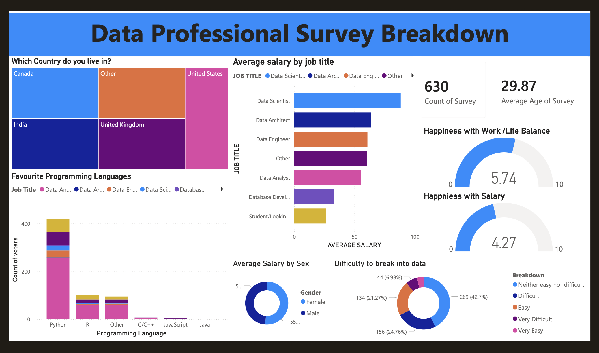

# 📊 Data Professional Survey Analysis – Power BI Dashboard

---

## 🔎 Project Overview

This project presents an end-to-end Business Intelligence solution developed in **Microsoft Power BI** to analyze survey data of 630 data professionals across multiple countries.

The dashboard transforms raw survey data into actionable insights through data cleaning, modeling, DAX calculations, and interactive visualizations.

---

## 📂 Dataset Details

- Total Survey Responses: 630  
- Average Respondent Age: ~29.8 years  
- Multiple job roles analyzed (Data Scientist, Data Engineer, Data Analyst, Data Architect, etc.)  
- Countries covered: India, United States, United Kingdom, Canada, Others  

---

## 🧩 Data Processing & Modeling

- Cleaned and transformed raw data using **Power Query (M Language)**
- Handled missing values and standardized categorical fields
- Converted data types and structured dataset for reporting
- Created calculated columns and measures using **DAX**
- Designed efficient data model for optimized performance

---

## 📐 DAX Measures Implemented

- Total Survey Count  
- Average Age  
- Average Salary by Job Title  
- Salary by Gender  
- Work-Life Balance Score  
- Salary Satisfaction Score  
- Career Entry Difficulty % Distribution  

Common DAX functions used:
`CALCULATE()`, `AVERAGE()`, `COUNT()`, `DIVIDE()`, `FILTER()`

---

## 📊 Dashboard Features

✔ Interactive slicers and filters  
✔ KPI summary cards  
✔ Salary comparison by job role  
✔ Gender-based salary analysis  
✔ Country-wise respondent breakdown  
✔ Programming language popularity analysis  
✔ Clean and structured visual storytelling  

---

## 🛠 Tech Stack

- Microsoft Power BI  
- DAX (Data Analysis Expressions)  
- Power Query  
- Data Modeling  
- Business Intelligence Reporting  

---

## 🎯 Key Insights Generated

- Salary benchmarking across roles and countries  
- Identification of most preferred programming languages (Python, R, Java, C/C++)  
- Understanding workforce satisfaction trends  
- Analysis of entry barriers into the data field  

---

## 📸 Dashboard Preview

---

## 🚀 Skills Demonstrated

- Data Cleaning & Transformation  
- Data Modeling  
- Advanced DAX  
- KPI Development  
- Dashboard Design  
- Insight Communication  

---

## 📌 How to Use

1. Download the `.pbix` file from this repository  
2. Open in Microsoft Power BI Desktop  
3. Explore interactive filters and insights  

---

## 👤 Author

**Sachin Nirate**  
Aspiring Data Analyst | BI Developer  

---

⭐ If you found this project useful, consider giving it a star!
